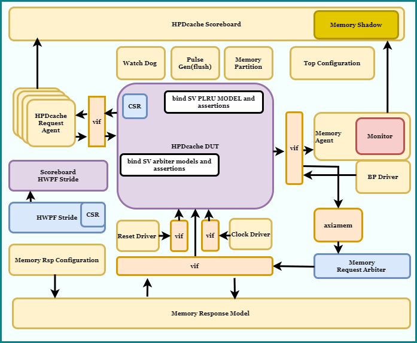
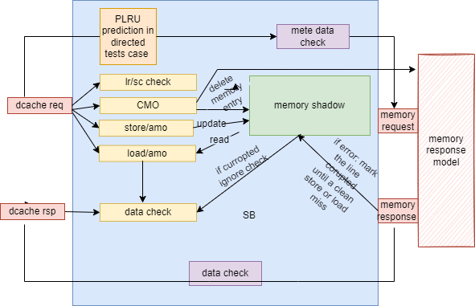

# HPDcache Subsystem Verification

## NOTE 
HPCache has been through a lot of changes in last few weeks and the TB remains unstable. 
For the moment CFG1 is working with memory responses without any error. 
The SV PLRU model has been commented. The directed PLRU tests runs only with write through write policy 


## Introduction

The purpose of this document is to outline the details of the verification environment of HPDcache Subsystem. The HPDcache subsystem is used to verify HPDcache DUT and prefetcher DUT.

##	Environnement
The environment is shown in the figure. The HPDcache subsystem contains 2 DUTs. HPDcache and Prefetcher.  An optional AXI5 (not verified yet) adapter is provided to convert memory request to AXI request. 

# Diagrams
 

##  Directory Structure 

Following directory structure of HPDCache needs to be respected to be able to use python scripts provided to compile(RTL+TB) and run a test. 

$PROJECT_DIR 
* testbench 
   - common
   - conf_and_perf_agent
   - dram_mon
   - env
   - files.f
   - hpdcache_agent
   - hwpf_stride_cfg
   - simu
   - test
   - top
* docs
   - TestPlan
* config
* libs
* modules
   - hpdcache_params
* scripts
* Images
* README.md
* LICENSE

$HPDCACHE_DIR
 * docs
 * rtl
   - src

$CV_DV_UTILS_DIR
* python
* sv
* uvm
   - Files.f
   - axi_superset_agent
   - bp_gen
   - bursty_sequence
   - clock_gen
   - clock_mon
   - dram_monitor
   - generic_agent
   - memory_partition
   - memory_rsp_model
   - memory_shadow
   - perf_mon
   - pulse_gen
   - reset_gen
   - spi_agent
   - unix_utils
   - watchdog

##  Setup 

Following variables need to be set to be able to run the UVM env correctly with python scripts provided with the TB 

Setup
```
1. setenv PROJECT_DIR           <TB DIR>
2. Update the submodule:
   * cd $PROJECT_DIR
   * git submodule sync
   * git submodule update --init --recursive --remote
2. setenv PROJECT_LIBS_DIR      ${PROJECT_DIR}/libs
3. setenv HPDCACHE_DIR          ${PROJECT_DIR}/modules/hpdcache
4. setenv CV_DV_UTILS_DIR       $CORE_V_VERIF/lib/cv_dv_utils
   * or setenv CV_DV_UTILS_DIR ${PROJECT_DIR}/modules/dv_utils/lib/cv_dv_utils
5. setenv QUESTA_PATH <questa_path> 
   ex: setenv QUESTA_PATH <path_to_your_install>/questasim/2023.3
   which vsim: <path_to_your_install>/questasim/2023.3/bin/vsim
6. setenv setenv PATH ${QUESTA_PATH}/bin:$PATH
   
```
##	Simulation 

Followin steps are needed to compile and run a test

1. cd $PROJECT_DIR/testbench/simu
2. Compile RTL and UVM testbench: 
```
   python3 $PROJECT_DIR/scripts/sim/sim_cmd_gen.py --help
   ex: python3 $PROJECT_DIR/scripts/sim/compile.py --cfg CONFIG1_HPC --outdir output --stdout 1
```

3. Run a test: 
```
   python3 $PROJECT_DIR/scripts/sim/run_test.py --help 
   ex: python3 $PROJECT_DIR/scripts/sim/run_test.py --test_name test_hpdcache_multiple_random_requests --seed 1 --debug "UVM_LOW" --batch 1 --dump 1 --num_txn 10 --stdout 1 --outdir output
```
4. Run a regression: 
```
   python3 $PROJECT_DIR/scripts/sim/run_reg.py --help 
   ex: python3 $PROJECT_DIR/scripts/sim/run_reg.py --reg_list $PROJECT_DIR/testbench/simu/hpdcache_nightly_test_list --cfg CONFIG1_HPC
```
# Note: THERE ARE STILL SOME KNOWN ISSUES OF CONGESTION TESTS for cfg_wbuf_threshold_i = 0
   
   Regression script is a very basic one. It just compiles RTL and TB and run nthreads tests in parallel. It generates a random seed for every iteration of a test. The regression list is provided as an input file. Regression list contains the name of the test and number of seeds to be run. 

The python scripts use following files, fileslist, defines, etc to compile the RTL and TB. 

1. RTL: To compile RTL with one of the 4 parameters set provided. 
   * {PROJECT_DIR}/modules/hpdcache/rtl/hpdcache.Flist
   * memory macro sv files
     * {HPDCACHE_DIR}/rtl/src/common/macros/behav/hpdcache_sram_wbyteenable_1rw.sv 
     * {HPDCACHE_DIR}/rtl/src/common/macros/behav/hpdcache_sram_1rw.sv 
     * {HPDCACHE_DIR}/rtl/src/common/macros/behav/hpdcache_sram_wmask_1rw.sv

   To be used as below with vlog command:
```
    vlog -f <options> {PROJECT_DIR}/modules/hpdcache/rtl/include/hpdcache_typedef.svh $({PROJECT_DIR})/modules/hpdcache_params/hpdcache_params_pkg_config1_HPC.sv <memory macros sv files> -F $(HPDCACHE_DIR)/rtl/hpdcache.Flist
```

2. DV_UTILS: Compile reusable cv_dv_utils uvm agents: to compile the testbench 
   * $CV_DV_UTILS_DIR/uvm/Files.f 

3. Top TB: Compile hpdcache specific uvm agents, sva files and misc intefaces 
   * $PROJECT_DIR/testbench/Files.f

4. UVM top:
   * $PROJECT_DIR/testbench/top/top_axi2mem.sv 

 A vlog command would looke like 
```
   vlog -f <options>  +define+AXI2MEM +define+<config_param> $PROJECT_DIR/testbench/top/top_axi2mem.sv -F $CV_DV_UTILS_DIR/uvm/Files.f -F $PROJECT_DIR/testbench/Files.f
```
Following defines are required to compile RTL and TB 
   * +define+AXI2MEM +define+<config_param>
     * - AXI2MEM       : adds an axi2mem uvm adapter to convert axi request to memory request
     * - config_param  : choose on of the configuration belore
      * - config_param = CONFIG1_HPC/CONFIG2_HPC/CONFIG3_EMBEDDED/CONFIG4_EMBEDDED

##	Reusable objects
Following existing reusable objects are used in the environment (dv utils): 
1.	Memory Response Model
    1.  Provide out of order with random delay memory responses.
2.	AXI2MEM converter 	
    1.	Convert axi request to memory response model requests 
3.	Reset Driver 	
    1.	Generate reset 
4.	Clock Driver 	
    1.	Generate clock 
5.	Watch Dog 
    1.	Generate timeout 
6.	Memory Partition 
    1.	Divide large memory in small memory section to be able to run simulation within a limited region 
7.	BP 
    1.	Generate back pressure on memory interface of HPDcache 
8.	Pulse Gen
    1.	Generate pulse to implement flush (not well tested yet) 

##	Key Components
Following are the key components of the environment. 
1.	HPDcache Request Agent:  This object is used to generate, drive and monitor the requests to the HPDcache. Following are some of the important pseudo random sequences :
  * a.	LR/SC sequence: The multiple LR/SC sequence runs single LR SC sequence. The single LR/SC sequence send 10 requests with the following constraints.
      - i.	90% same address, 10% different random address 
      - ii.	40% LR, 40% SC, 10%LOAD, 1% each for the rest of STORE and AMOs.
      - iii.	The aim is to have all possible LR/SC scenarios. 
  * b.	Directed address sequence: In this sequence, NWAYS + 1 TAG/SET combination are chosen randomly at the beginning of the test. All requests are sent to these addresses. The aim is to have many hits with an eviction from time to time.  
  * c.	Random sequence with in a region: The memory partition agent is used to partition the memory space. One region is randomly selected and requests are made within this region. 
  * d.	Congestion sequences: Congestion sequences block memory response model for predefined random number of cycles. Many requests are (load or store) sent, on the same set or different. The idea is to fill write buffer and rtab in the case of write or mshr sets or rtab in the case of load. Please refer to section 2.3 if testplan to get the details of these sequences. 
2.	Config Agent: This object is used to generate and drive the different configuration variables of HPDcache. 
3.	AXI2MEM converter: The memory interface of the HPDcache is an AXI inspired interface. The data and meta data channel are independent to one another.  This object is used to streamline the data and the meta data to be able to drive it to the memory response model.
4.	Memory Agent: It monitors the memory interface of HPDcache. 
5.	Memory response model: The response model is used to drive the responses of memory requests made by HPDcache. The response model implements following features : 
  * a.	It can be configured to drive the responses in order or out of order. 
  * b.	It drives read and write responses independently 
  * c.	It can be used to send error responses 
  * d.	It supports AMOs
  * e.	It can be used to insert back pressure 

##	Scoreboard

# Diagrams
 
 
1.	When HPDcache request is received :
  a.	LOAD/LR/AMO: memory shadow is read and data is stored in a list (m_load_list) 
  b.	STORE/SC (pass)/ AMO: memory shadow is updated. In the case of STORE, a merge list is maintained and updated. It is used to correctly predict the write request at memory interface. 
  c.	CMO:  The corresponding entries are removed from the memory response model and shadow memory. We expect a new data from the CACHE now @the same address. 
  d.	LR/SC check is performed
2.	When HPDcache response is received 
  a.	LOAD/LR/AMO: Data received is checked against the data read from the memory shadow(m_load_list)
  b.	An exact prediction of error response is made and verified. 
3.	Bit-LRU prediction: A special test is considered to verify the LRU alogrithm used. In the test, some directed combination (NWAY +1) of set and tags are chosen. They should trigger an eviction from time to time. These requests are made every N number of cycles to avoid request and refill race condition. This way without spying internal signal the LRU algo can be verified. 
4.	Memory request: Memory response model is read or updated.
5.	Memory response: Reponse is sent to data cache. An error is inserted from time to time. 

##	Verification Methodologies
Following methodologies are used to verify the HPDcache subsystem: 

##	Universal Verification Methodology (UVM)
UVM libraries are used to develop the verification environment. All objects are written in system Verilog. Some of the following points are to be noted: 
1.	UVM messaging is used to for easy debug (section 6)
2.	Objects are built in the build phase 
3.	Objects and analysis ports are connected to each other in the connect phase
4.	Configuration objects are randomize in the end of elaboration phase (test base).
5.	Static configurations are done in the configure phase (test base).
6.	Sequences are run in the main phase 
7.	Phase jump is used to do the reset on the fly verification (test base).
8.	Cover groups are used to do the coverage

##	Assertion Based Verification (ABV) 

Assertions are used at different level in the design. 
1.	Assertions are used within the RTL to verify different properties of the design. 
2.	Assertions are used in the system verilog interfaces to do basic verification ex $unknown, $onehot, etc. 
3.	Assertions are used to cover some functionalities of design. 
4.	Systemverilog based model: bind to following module of HPDcache to do assertion based white box testing
a.	Arbiter
b.	PLRU and TAG directory modelling 


## Regression 

The regression suite contains following HPDcache tests(TEST_NAME). (Please check the Test Plan for details)
1.	test_hpdcache_multiple_load_store_requests
2.	test_hpdcache_multiple_load_store_requests_in_region
3.	test_hpdcache_multiple_directed_addr
4.	test_hpdcache_multiple_amo_lr_sc_requests
5.	test_hpdcache_multiple_random_requests
6.	test_hpdcache_multiple_random_requests_in_region
7.	test_hpdcache_multiple_random_requests_uncached
8.	test_hpdcache_multiple_random_requests_with_memory_bp
9.	test_hpdcache_multiple_directed_addr_bPLRU_prediction
10.	test_hpdcache_multiple_consecutive_set_load_with_memory_bp
11.	test_hpdcache_multiple_consecutive_set_store_with_memory_bp
12.	test_hpdcache_multiple_same_tag_set_store_with_memory_bp
13.	test_hpdcache_multiple_same_tag_set_store_random_threshold_no_reset_timecnt_with_memory_bp
14.	test_hpdcache_multiple_same_tag_set_store_random_threshold_reset_timecnt_with_memory_bp
15.	test_hpdcache_multiple_consecutive_set_load_with_ready_bp
16.	test_hpdcache_multiple_consecutive_set_store_with_ready_bp
17.	test_hpdcache_multiple_same_tag_set_store_with_ready_bp
18.	test_hpdcache_multiple_same_tag_set_store_random_threshold_no_reset_timecnt_with_ready_bp
19.	test_hpdcache_multiple_same_tag_set_store_random_threshold_reset_timecnt_with_ready_bp
20.	test_hpdcache_multiple_cacheable_load_only_performance_check_with_memory_bp
21.	test_hpdcache_multiple_cacheable_load_only_performance_check_no_memory_bp
22.	test_hpdcache_multiple_cacheable_store_only_performance_check_no_memory_bp

# Note: THERE ARE STILL SOME KNOWN ISSUES OF CONGESTION TESTS for cfg_wbuf_threshold_i = 0
##	Debugging 

Following is an example to debug an UVM_ERROR. The grep on a UVM_ERROR gives the set and tag, which have an error as follows. 

grep UVM_ERROR test_HPDcache_multiple_directed_addr_709346482.log
 UVM_ERROR HPDcache_sb.svh(556) @ 8063 ns: uvm_test_top.env.m_HPDcache_sb [SB HPDCACHE DATA ERROR] ADDR=16b19f744e580(x), SET=22(d), TAG=b58cfba27(x) BYTE=0(d) ACC DATA=e1(x) EXP DATA=86(x)
 UVM_ERROR HPDcache_sb.svh(556) @ 8063 ns: uvm_test_top.env.m_HPDcache_sb [SB HPDCACHE DATA ERROR] ADDR=16b19f744e580(x), SET=22(d), TAG=b58cfba27(x) BYTE=0(d) ACC DATA=73(x) EXP DATA=f3(x)
 UVM_ERROR :    2

Further, a grep on set and tag gives the flow of the data. 
grep "SET=22(d), TAG=b58cfba27" test_HPDcache_multiple_directed_addr_709346482.log | grep SB | grep UVM_ERROR -B20
 UVM_INFO <local_path>/testbench/common/HPDcache_common_pkg.sv(58) @ 7894 ns: reporter [SB HPDCACHE REQ 1] OP=HPDCACHE_REQ_AMO_XOR SID=1(x), TID=53(x), ADDR=16b19f744e580(x) SET=22(d), TAG=b58cfba27(x), WORD=0(x) DATA=30ff51e7c17b7d3d67dc80fbf245b930(x) BE=ff(x) SIZE=3(x) NEED_RSP=1(x) UNCACHEABLE=0(x)
 UVM_INFO <local_path>/testbench/common/HPDcache_common_pkg.sv(113) @ 7897 ns: reporter [SB MEM REQ] ID=80(x), ADDR=16b19f744e580(x) SET=22(d), TAG=b58cfba27(x), WORD=0(x) SIZE=3(d) LEN=0(d), CMD=HPDCACHE_MEM_ATOMIC ATOMIC=HPDCACHE_MEM_ATOMIC_EOR CACHEABLE=0(x)
 UVM_INFO <local_path>/testbench/common/HPDcache_common_pkg.sv(128) @ 7899 ns: reporter [SB MEM EXT REQ] ID=80(x), ADDR=16b19f744e580(x) SET=22(d), TAG=b58cfba27(x), WORD=0(x)  Data=30ff51e7c17b7d3d67dc80fbf245b93030ff51e7c17b7d3d67dc80fbf245b93030ff51e7c17b7d3d67dc80fbf245b93030ff51e7c17b7d3d67dc80fbf245b930(x) BE=ff(x) SIZE=3(d) LEN=0(d), CMD=HPDCACHE_MEM_ATOMIC ATOMIC=HPDCACHE_MEM_ATOMIC_EOR CACHEABLE=0(x)
 UVM_INFO <local_path>/testbench/common/HPDcache_common_pkg.sv(89) @ 7902 ns: reporter [SB MEM READ RSP] ID=80(x), SET=22(d), TAG=b58cfba27(x), WORD=0(x)  ERROR=0(x), LAST=0(x) DATA=8742ea60050f3a837fd3f1db5f349916899c82edd519d10968357dd75b88910f69462f02a6f3adbd3bea28eab711bd6f009f09e91bfdeb87e17f73b37b658b96(x)
 UVM_INFO <local_path>/testbench/common/HPDcache_common_pkg.sv(128) @ 7902 ns: reporter [SB MEM EXT RSP] ID=80(x), ADDR=16b19f744e580(x) SET=22(d), TAG=b58cfba27(x), WORD=0(x)  Data=30ff51e7c17b7d3d67dc80fbf245b93030ff51e7c17b7d3d67dc80fbf245b93030ff51e7c17b7d3d67dc80fbf245b93030ff51e7c17b7d3d67dc80fbf245b930(x) BE=ff(x) SIZE=3(d) LEN=0(d), CMD=HPDCACHE_MEM_ATOMIC ATOMIC=HPDCACHE_MEM_ATOMIC_EOR CACHEABLE=0(x)
 UVM_INFO <local_path>/testbench/common/HPDcache_common_pkg.sv(58) @ 7903 ns: reporter [SB HPDCACHE RSP] OP=HPDCACHE_REQ_AMO_XOR SID=1(x), TID=53(x), ADDR=16b19f744e580(x) SET=22(d), TAG=b58cfba27(x), WORD=0(x) DATA=9f09e91bfdeb87e17f73b37b658b96(x) BE=ff(x) SIZE=3(x) NEED_RSP=1(x) UNCACHEABLE=0(x)
 UVM_INFO <local_path>/testbench/common/HPDcache_common_pkg.sv(58) @ 8016 ns: reporter [SB HPDCACHE REQ 1] OP=HPDCACHE_REQ_LOAD SID=1(x), TID=54(x), ADDR=16b19f744e580(x) SET=22(d), TAG=b58cfba27(x), WORD=0(x) DATA=ac4200ec07b7662a975873830f25ae32(x) BE=d(x) SIZE=2(x) NEED_RSP=0(x) UNCACHEABLE=0(x)
 UVM_INFO <local_path>/testbench/common/HPDcache_common_pkg.sv(58) @ 8035 ns: reporter [SB HPDCACHE REQ 1] OP=HPDCACHE_REQ_AMO_MAX SID=1(x), TID=4c(x), ADDR=16b19f744e580(x) SET=22(d), TAG=b58cfba27(x), WORD=0(x) DATA=fac95c55a9bdf9f1eaeef173217a9670(x) BE=f(x) SIZE=2(x) NEED_RSP=1(x) UNCACHEABLE=0(x)
 UVM_INFO <local_path>/testbench/common/HPDcache_common_pkg.sv(113) @ 8038 ns: reporter [SB MEM REQ] ID=80(x), ADDR=16b19f744e580(x) SET=22(d), TAG=b58cfba27(x), WORD=0(x) SIZE=2(d) LEN=0(d), CMD=HPDCACHE_MEM_ATOMIC ATOMIC=HPDCACHE_MEM_ATOMIC_SMAX CACHEABLE=0(x)
 UVM_INFO <local_path>/testbench/common/HPDcache_common_pkg.sv(128) @ 8040 ns: reporter [SB MEM EXT REQ] ID=80(x), ADDR=16b19f744e580(x) SET=22(d), TAG=b58cfba27(x), WORD=0(x)  Data=fac95c55a9bdf9f1eaeef173217a9670fac95c55a9bdf9f1eaeef173217a9670fac95c55a9bdf9f1eaeef173217a9670fac95c55a9bdf9f1eaeef173217a9670(x) BE=f(x) SIZE=2(d) LEN=0(d), CMD=HPDCACHE_MEM_ATOMIC ATOMIC=HPDCACHE_MEM_ATOMIC_SMAX CACHEABLE=0(x)
 UVM_INFO <local_path>/testbench/common/HPDcache_common_pkg.sv(89) @ 8042 ns: reporter [SB MEM READ RSP] ID=80(x), SET=22(d), TAG=b58cfba27(x), WORD=0(x)  ERROR=0(x), LAST=0(x) DATA=8742ea60050f3a837fd3f1db5f349916899c82edd519d10968357dd75b88910f69462f02a6f3adbd3bea28eab711bd6f009f09e91bfdeb8786a3f348892032a6(x)
 UVM_INFO <local_path>/testbench/common/HPDcache_common_pkg.sv(128) @ 8042 ns: reporter [SB MEM EXT RSP] ID=80(x), ADDR=16b19f744e580(x) SET=22(d), TAG=b58cfba27(x), WORD=0(x)  Data=fac95c55a9bdf9f1eaeef173217a9670fac95c55a9bdf9f1eaeef173217a9670fac95c55a9bdf9f1eaeef173217a9670fac95c55a9bdf9f1eaeef173217a9670(x) BE=f(x) SIZE=2(d) LEN=0(d), CMD=HPDCACHE_MEM_ATOMIC ATOMIC=HPDCACHE_MEM_ATOMIC_SMAX CACHEABLE=0(x)
 UVM_INFO <local_path>/testbench/common/HPDcache_common_pkg.sv(58) @ 8045 ns: reporter [SB HPDCACHE RSP] OP=HPDCACHE_REQ_AMO_MAX SID=1(x), TID=4c(x), ADDR=16b19f744e580(x) SET=22(d), TAG=b58cfba27(x), WORD=0(x) DATA=9f09e91bfdeb8786a3f348892032a6(x) BE=f(x) SIZE=2(x) NEED_RSP=1(x) UNCACHEABLE=0(x)
 UVM_INFO <local_path>/testbench/common/HPDcache_common_pkg.sv(58) @ 8062 ns: reporter [SB HPDCACHE REQ 1] OP=HPDCACHE_REQ_LOAD SID=1(x), TID=73(x), ADDR=16b19f744e580(x) SET=22(d), TAG=b58cfba27(x), WORD=0(x) DATA=a3c6d2b301a03f80f1fac4ade93a421d(x) BE=93a5(x) SIZE=4(x) NEED_RSP=1(x) UNCACHEABLE=0(x)
 UVM_INFO <local_path>/testbench/common/HPDcache_common_pkg.sv(58) @ 8063 ns: reporter [SB HPDCACHE RSP] OP=HPDCACHE_REQ_LOAD SID=1(x), TID=73(x), ADDR=16b19f744e580(x) SET=22(d), TAG=b58cfba27(x), WORD=0(x) DATA=9f09e91bfdeb87e17f73b3217a9670(x) BE=93a5(x) SIZE=4(x) NEED_RSP=1(x) UNCACHEABLE=0(x)
 UVM_ERROR HPDcache_sb.svh(556) @ 8063 ns: uvm_test_top.env.m_HPDcache_sb [SB HPDCACHE DATA ERROR] ADDR=16b19f744e580(x), SET=22(d), TAG=b58cfba27(x) BYTE=0(d) ACC DATA=e1(x) EXP DATA=86(x)
 UVM_ERROR HPDcache_sb.svh(556) @ 8063 ns: uvm_test_top.env.m_HPDcache_sb [SB HPDCACHE DATA ERROR] ADDR=16b19f744e580(x), SET=22(d), TAG=b58cfba27(x) 
